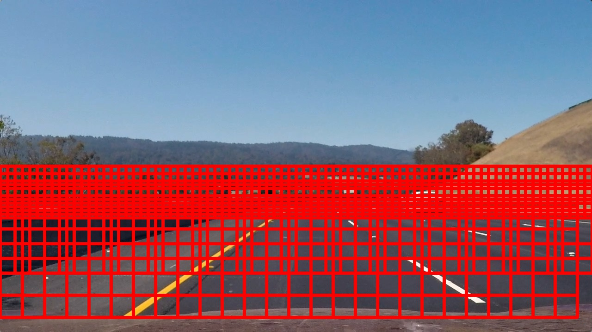

# Self-Driving Car Engineer Nanodegree


## Project: **Vehicle Detection and Tracking** 
### **Adam Tetelman**
***
In this project I used used various image processing techniques to extract features that could be used to train a model to identify cars on the road. I then implemented this model into a pipeline that could detect and track vehciles from a video feed. I finished by using a combination of intuition, calculation, and experimentation to tune model and pipeline parameters.

The project relies on the following packages:
- python3 (and standard libraries)
 - scikit (scikit-image and sci-kit learn for model training and feature extraction)
 - numpy (for array manipulation)
 - cv2 (for image processing - opencv2)  
 - matplotlib (for debugging/tuning and rendering images)
 - moviepy (for video rendering)
 - Jupyter/Ipython (for this notebook)

The tools taught included: 
- Data Exploration
- Color Histogram Features
- Spatial Features
- Hue of Gradient Features
- Sliding Window Technique
- Support Vector Machines
- Template Matching
- Colorspace Pros/Cons
- Decision Trees
- Degrading Heat Maps

The resources used included:
- ./output (result images and videos)
- ./camera_cal (camera calibration images)
- ./test_img (test images)
- ./test_vid (test videos)
- ./data ( running ./get_data.sh will create and download train data here)

The code is structured into a base `Pipeline` class which defines some debug and what a pipeline must have as well as `car_helper` which has common functionality. There is the previous `LaneLines` and `Lines` Class from the lane tracking project. The `CarWorld` Class is a container pipeline responsible for running the other pipelines (LaneLines and VehicleDetection). Each of the class modules containes test code. Lastly, the bulk of the new code is in the `VehicleDetection` Pipeline class (responsible for tracking cars) and the `CarData` class (responsible for extracting and parsing train data).

The test images can be reproduced by running the vehicle_detection.py module. The output videos can be reproduced by running the car_world.py module.


```python
from IPython.display import HTML
```

## Project Summary
This project had three main stpes. I first had to extract, analyze, and augment the data. I then had to extract features and iterativly train/tune a model. I then had to iteratively tune my vehicle search and vehcile tracking pipeline. Of course, in addition to these steps I added a great deal of debug code to give insights into the system behavior.

- Data [`CarData.get_class_data`]
  - Data Exploration
  - Data Augmentation
- Model (Detection) [`VehcileDetection.train`]
  - Feature Extraction
  - Model Training and Tuning
- Pipeline (Search and Tracking) [`VehicleDetection.pipeline`]
  - Sliding Window Search 
  - Vehicle Tracking

### Data

The data I used came from the GTI data set and the KITTI dataset. They contained samples of car and non-car images. In addition to that, the GTI data set contained car images from Far, Close, Left, and Right. I implemented `CarData` in such a way that it could sample from any combination of thoe features/datasets.  Below is a small sampling of that data.


```python
%matplotlib inline
import car_data
car_data.car_data_test()
```


### Choosing Features

Before extracting any features I convert the image to the color specified in `VehicleDetection.color`.

I then extract the following features. Each of the features can be disabled using the `VehicleDetect.<ftr>_dis` flag.

- Spatial Features, this is the image scaled down to `VehicleDetection.spatial_size`
- Color Histogram, this is a histogram of `VehicleDetection.hist_bins` bins for each value found in a given channel.
  - The `VehicleDetection.hist_channels` parameter is a list of channels to use
- Hue of Gradient, this is feature that represents the gradient in blocks of cells throught the image
  - The `VehicleDetection.hog_channels` parameter is a list of channels to use

In my testing using large values of `VehicleDetection.spatial_size` greatly increased memory demands with no gain.

When I tried only using HOG features prediction time remained similar, however accuracy in the videos was much lower. I am not certain whether the color features or the spatial features were more useful, however they added minimal processing time so I left them both in; this would be a good future area of study. Removing the HOG features yielded similarly poor results.

It is worth noting that during training all images were resized to `VehicleDetection.train_shape` and throughout the pipeline all images were converted from `RGB` for videos, from `BGR` for images, and scaled up to [0-255] in the case of .png files.

<br><table> <b>Features left-to-right (img, color_img, spatial_features, color_histogram for each channel, hog for each channel)</b>
<td><b>Test image 1</b></td>
<td><b>Test image 2</b></td>
<td><b>Test image 3</b></td>
<tr>
</tr>
<tr>
<td></td>
<td></td>
<td></td>
</tr>
</table>

### Training the Model

The model I used had two core componenents from the sklearn library. I used a `sklearn.preprocessing.StandardScaler` to scale X values and I used the Support Vector Machine implementation in `sklearn.svm.LinearSVC` to classify data.

The training pipeline is in `VehicleDetection.train` and has the following steps:
- Read in image data
- Convert raw pixel data into flattened feature vectors
- Fit the scaler to the feature data
- Transform feature data using scaler
- Split the raw data into Train & Test (66% of data was used for training)
- Train the SVM on the train data
- Test the accuracy of the SVM on the test data
- Validate all the data/parameters/models are correct and save them to disk

## Pipeline Summary

In order to run a video throught the vehicle detection pipeline I first load the saved models and parameters. The identification pipeline needed to use the same features/color spaces as the training model to avoid poor detection or errors. Of course, all images are undistorted before making it to the Vehicle Detection pipeline.

The detection pipeline looked as follows:
- Convert image color
- Detect blocks containing cars [`VehicleDetection.scaling_detect_blocks`]
- Track cars over time [`VehicleDetection.detect_cars`]

<br><table> <b>Pipeline steps (color conversion, show all windows, show detected windows, heatmap, labels, output)</b>
<tr>
<td><b>Test image 1</b></td>
<td><b>Test image 2</b></td>
<td><b>Test image 3</b></td>
</tr>
<tr>
<td></td>
<td></td>
<td></td>
</tr>
</table>

<br><table> <b>Final pipeline output (single clip in time will be noiser than video)</b>
<tr>
<td><b>Test image 1</b></td>
<td><b>Test image 2</b></td>
<td><b>Test image 3</b></td>
</tr>
<tr>
<td></td>
<td></td>
<td></td>
</tr>
</table>

### Histogram of Oriented Gradients (HOG)

#### Training

During training I extract the hog features using in `VehicleDetection.get_hog_features` using the sklearn hog function. After extracting the features for each individual color channel I flatten them and append them to each other.

#### Pipeline

During the pipeline I do something slightly different. the training images are 64x64, however the input images are 1280x720. To avoid re-calculating a lot of data over and over again I only calculate the hog values for the entire 1280x720 image (and I do not flatten/append these values). As I iterate over each detection window I take the subset of hog features for each individual patch, and only flatten/append those 64x64x3 features for model prediction (see the for loop in `VehicleDetection.detect_blocks`). 

#### Parameters

I chose 2 cells per block and 8 pixels per cell somewhat arbitrarly. They are the values I started with and seemed to do well; changing these values may very well yeild more effiecient results.

I chose 9 orientation bins based off how "edgy" the visulations looked.

I chose a window_count of 64 because the train images were 64x64 so it seemed to make sense that a 64x64 window should capture a whole care.

I chose all color spaces because experimental results showed that to work fairly well and removin channels under different color spaces did reduce performance.

I chose the YCrcb Color space because it seemed to have a good amount of variance across each of the channels.

##### Final HOG parameters:
- window_count [`VehicleDetection.window_count`] = 64 # The x/y size of the windows
- pixel_per_cell [`VehicleDetection.pix_per_cell`] = 8 # Number of pixels in a HOG cell
- cell_per_block [`VehicleDetection.cell_per_block`] = 2 # Number of cells in a single block (
- orient [`VehicleDetection.orient`] = 9 # Number of gradient bins
- hog_channels [`VehicleDetection.hog_channels`] = [0, 1, 2] # All channels
- color_space [`VehicleDetection.color`] = YCrCb # Color space used

<br><table> <b>HOG images for channel 0, 1, and 2 forOrient values (6 through 11) - test image 2</b>
<tr>
  <td><b>Channel 0</b></td>
  <td><b>Channel 1</b></td>
  <td><b>Channel 2</b></td>
</tr>
<tr>
  <td></td>
  <td></td>
  <td></td>
</tr>
<tr>
  <td></td>
  <td></td>
  <td></td>
</tr>
<tr>
  <td></td>
  <td></td>
  <td></td>
</tr>
<tr>
  <td></td>
  <td></td>
  <td></td>
</tr>
<tr>
  <td></td>
  <td></td>
  <td></td>
</tr>
<tr>
  <td></td>
  <td></td>
  <td></td>
</tr>
</table>

### Sliding Window Search

In order to locate cars across the Image I create a window and slide it left/right and up/down across the images. In order to avoid missing any cars these windows will largely overlap. As an additional optimization I do not bother searching for cars in the horzion. As a way to boost accuracy I search for cars at various scales (cars far away appear smaller, closer appear larger).

I define the start/end y locations to scan in `VehicleDetection.ystart` and `VehicleDetection.yend`.

The windows start at the top left. The windows are `window_count` (64x64) wide/tall. Each window will be `step_size` (2) * `pix_per_cell` (16) pixels right or down from the previous window (hog feature space will be smaller than the number of pixels by a factor of `pix_per_cell`). The windows continue in this manner until they reach the bottom corner. The results is around 3000 windows that overlap 75% of the same pixels from the top left of the non-horizon range to the bottom right of the image.

In order to take care of finding cars at different scales up/down the img I implemented `scaling_detect_blocks`. This function searches for cars left/right in 200 pixel vertical stripes. Each vertical stripe is 50 pixels lower than the last and looks for cars at a scale 0.2 larger. The start/end locations of the stripes are dependant on the `ystart` and `yend` values.

#### Window Search Parameters

I tuned the scaling by visually inspecting the size of the windows and visually comparing it to the expected size of the car at that y value.

I tuned the window step size by moving experimentally trying various values on a smaller video sample and juding the results.

I chose the window size to be similar to the train data.

<br><table> <b>Sliding Windows Images for test image 1, 2, and 3</b>
<tr>
  <td><b>Test image 1</b></td>
  <td><b>Test image 2</b></td>
  <td><b>Test Image 3</b></td>
</tr>
<tr>
  <td></td>
  <td></td>
  <td></td>
</tr>
</table>

<br><table> <b>Different Window Scale Images for test image 1, 2, and 3</b>
<tr>
  <td><b>Test image 1</b></td>
  <td><b>Test image 2</b></td>
  <td><b>Test Image 3</b></td>
</tr>
<tr>
  <td></td>
  <td></td>
  <td></td>
</tr>
</table>


### Vehicle Tracking

Regardless of the tuning parameters used, the SVM seems to have noisy results. When the sliding window search completes there are many blocks detected without cars (False Positives). However, the model is very food at actually detecting cars, and because the sliding windows are very close to each other, there are many overlapping windows.

To remove the false I create a heatmap the size of the original image. I increment each pixel by 1 for every detected block it is in. The result is a heatmap with large values where many windows overlapped and small values for false positives. I store the last N heatmaps in `VehicleDetection.heatlist`. I average out the values of the last N heatmaps, and set any pixel below the `VehicleDetection.heat_thresh` to zero. The result of this is a fairly robust system that looks back in time and is able to track cars that are stationary or moving.

I then use the label function to break this heatmap clusters into individual cars and draw boxes around the corners.


<br><table> <b>Block Detections, Heat maps and Labeled Images for test image 1, 2, and 3</b>
<tr>
  <td><b>Test image 1</b></td>
  <td><b>Test image 2</b></td>
  <td><b>Test Image 3</b></td>
</tr>
<tr>
  <td></td>
  <td></td>
  <td></td>
</tr>
<tr>
  <td></td>
  <td></td>
  <td></td>
</tr>
<tr>
  <td></td>
  <td></td>
  <td></td>
</tr>
</table>

# Results

The results of this effort were a pipeline that can fairly accurately locate, track, and outline the location of several moving cars throughout a video.

<video width="960" height="540" controls>
  <source src="output/project_video_output_debug.mp4" type="video/mp4">
</video>

The final video output can be found in `output/project_video_output.mp4`

# Conclusion

I was able to take a dataset of car and not car images, extract several features from the raw pixel, train a model, use that model to identify cars, and then track those cars over time. There were some decisions that had to be made when deciding on the size and types of features to use. Similarly there were decisions to be made on where to look for those features in the pipeline, how big those features should appear, and how often they should occur to classify a car. All of these decisions worked to make the pipeline more/less accurate and more/less robust.

#### Pitfalls
One of the largest pitfalls for this system is the require processing time. Each image took several seconds to process. If this were to be put into place in a real care it would be need to be run on a much faster computer, or more realisticly, re-written using more performant technologies meant for real time systems. Because of this, this project seems more like a POC than an actual deliverable, and would likely need to be ported to C++ and optimized.

This long processing time also made it difficult to train and iterate the pipeline. With a bit more tuning, it is likely the the numbers of windows used could be greatly reduced without sacrificing much performance.

The pipeline begins to fail when cars are very small in the left/right distance. In most roads this is not a problem or common, however in large multi-lane highways this may cause the pipeline more trouble. It may be necessary to use scaling towards the left/right horizon similar to the front/back horizon scaling.

The pipeline gets confused when multiple cars are passing or close to each other. It had a tendency to group them up as a single car. A possible solution to this might be do further analysis on the detected blocks and label them based on various features rather than simply proximity to other detected blocks.

#### Future Research
I would have liked to explore more color spaces. The one I decided on worked good, but most of my test images were from well lit areas. It seems that using a different color space or a combination of color spaces may yield more generalizable results.

I would like to re-approach this problem using a tensorflow CNN pipeline instead of a SVM. The bulk of the processing time was taken up in the sliding window and feature extraction, and I would guess that this could be reduced while possibly increasing accuracy using current deep learning techniques.

I would like to attempt adding more data, or augmenting the data a bit more than I did.

I would like to spend some more time fine-tuning the window search and window search scaling.

#### Summary

In 600 lines of code I was able track Lane Lines. In another 600 lines of code I was able to detect and track cars. In another 300 lines of code I was able to utilize these pipelines to process and annotate videos. These are all rather difficult tasks that have been accomplished by using a diverse set of machine learning, computer vision, and software engineering approaches. 
